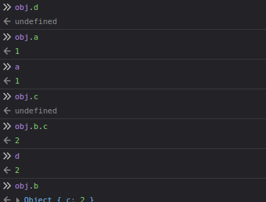
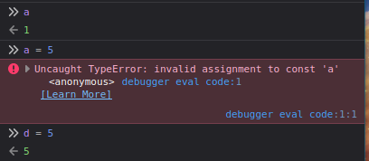

## The prototype:
- All objects in JavaScript have a prototype that its children can inherit.
```js
function Player(name, marker){
    this.name = name;
    this.marker = marker;
    this.sayName = function() {
        console.log(this.name)
    };
}

const player1 = new Player('steve', 'X');
const player2 = new Player('also steve', 'O');

Player.prototype.sayHello = function () {
    console.log("Hello I'm a player");
};

player1.sayHello();
player2.sayHello();

```
- Object.prototype -> Player.prototype -> Player objects (player1, player2)
- Every `prototype` object inherits from `Object.prototype` by default.

- You can `.setPrototypeOf` an object for example you can do:
    `Object.setPrototypeOf(Player.prototype, Person.prototype)`
and then when you do `Object.getProtypeOf(Player.prototype)` it will return 
`Person.prototype`. This way we can access both functions from `Player` and `Person` prototypes.

```js
function Person(name){
    this.name = name;
}

Person.prototype.sayName = function() {
    console.log(`Hello, I'm ${this.name}!`);
};

function Player(name, marker){
    this.name = name;
    this.marker = marker;
}

Player.prototype.getMarker = function(){
    console.log(`My marker is '${this.marker}'`);
};

Object.getPrototypeOf(Player.prototype);

Object.setPrototypeOf(Player.prototype, Person.prototype);
Object.getPrototypeOf(Player.prototype);


const player1 = new Player('steve', 'X');
const player2 = new Player('also steve', 'O');

player1.sayName();
player2.sayName();

player1.getMarker();
player2.getMarker();

```

Note:
- Make sure you do `Object.setPrototypeOf()` before creating any objects 
as this will cause performance issues

## Writing doesn't use prototype
- The prototype is only used for reading properties, Write/delete 
works directly with the object. 
- Accessor properties are the exception, as assignment is handled
by a setter function. So writing to such a property is actually the 
same as calling a function.
- We can use the built-in method `.hasOwnProperty(key)` to check if the
property is inherited or not.
- this refers to the object we pass in when we call our method. This way
we can modify the states of the inheriting objects but not the parent object.

## Closures:
```js
function makeAdding (firstNumber)
{
    const first = firstNumber;
    return function resulting (secondNumber){
        const second = secondNumber;
        return first + second;
    }
}

const add5 = makeAdding(5);
console.log(add5(2)) // logs 7
```
1) the `makeAdding` function takes an argument, `firstNumber`, declares
a constant `first` with the value of `firstNumber`, and returns another function.
2) when an argument is passed to the returned function, which we have assigned to 
add5, it returns the result of adding up the number passed earlier to the number passed now.

Functions in JavaScript form closures. A closure refers to the combination of a 
function and the surrounding state in which the function was declared.
This surrounding state in which the function was declared. 

This surrounding state, also called its lexical environment, consists of
any local variables that were in scope at the time of the closure was made.

Here, `add5` is a reference to the `resulting` function, created when the
`makeAdding` function is executed, thus it has access to lexical environment
of the `resulting` function, which contains the `first` variable, making it
available for use.

## Lexical scope?
Lexical scope refers to the context in which variables and functions are
accessible or visible. Lexical Scopes can be broadly classified into two
categories: Global Scope and Local Scope.

## Lexical Environment?
Lexical Environment, on the other hand, is a more concrete mechanism employed
by JavaScript's engine during runtime to manage and access the variables based
on the Lexical Scope. It is part of the JavaScript execution context that consists
of two significant parts:
1) The Environment Record: This is where the specific variables, constants, and functions
defined within the Lexical Scope are actually stored.
2) A reference to the outer environment: This refers to the Lexical Environment
of the parent scope. It allows for the chain through which Javascript searches
for variable values when a variable isn't found in the immediate Lexical Environment.

Lexical environments are created every time a block of code or a function is executed 
containing all the local variables and being linked to an outer Lexical Environment.
This effectively forms a Scope Chain that determines how variable lookups occur during 
the execution of the code.

## Factory functions :factory:
They work similar to how constructors do, but with one clear difference,
they levy the power of closures, instead of using the `new` keyword to create
an object. Factory functions set up and return the new object when you call the function.
They do not use the prototype, which incurs a performance penalty. Though as
a general rule this performance penalty isn't significant unless you're creating
a thousand of objects.

```js
const User = function (name){
    this.name = name;
    this.discordName = "@" + name;
}
//this is a constructor -
//then this can be turned into a factory


function createUser(name){
    const discordName = "@" + name;
    return {name, discordName};
}
```

### The object shorthand notation
```js
const name = "Bob";
const age = 28;
const color = "red";

const thatObject = { name: name, age: age, color: color };

//if we have variables with the same name as that of the property we are assigning to
// then we can write it once.
const nowFancyObject = { name, age, color };

console.log( name, age, color ); //this outputs a mess Bob 28 red

console.log({ name, age, color }); //this now logs as {name: "Bob", age: 28, color: "red"}

```

#### Destructuring:
When you have an object, you can extract a property of an object into a 
variable of the same name, or any named variable for an array.

```js
const obj = { a: 1, b:2 };
const { a, b } = obj;
// This creates two variables, a and b
// which are equivalent to
// const a = obj.a
// const b = obj.b

const array = [1, 2, 3, 4, 5];
const [ zerothEle, firstEle ] = array;
// this creates zerothEle and firstEle, both of which point
// to the elemtns in the 0th and 1st indices of the array
```
### Destructuring examples:
- Example 1:
```js
let a, b, rest;
[ a, b ] = [10, 20];

console.log(a);
// should return 10

console.log(b);
// should return 20

[ a, b, ...rest ] = [10, 20, 30, 40, 50];

console.log(rest);
```
#### Binding and Assignment
```js
const obj = { a: 1, b: {c: 2 } };
const {
    a,
    b: { c: d },
} = obj;
// Two variables are bound: 'a' and 'd'
```


```js
const obj = { a: 1, b: {c: 2 } };
const { a } = obj; // a is constant

let {
    b: { c: d },
} = obj; // d is reassignable
```


- We don't need to use `var` or `let`:
```js
const numbers = [];
const obj = { a: 1, b: 2 };

({ a: numbers[0], b: numbers[1] } = obj);
```
however we need to make sure that we use parenthesis for this statement as we are
not using `var` or `let`.

#### Default values:

Each destructuring property can have a *default* value. The default value 
is used when the property isn't present, or has value `undefined`. It is not used
if the property has a value `null`.
```js
const [ a = 1 ] = []; // a is 1
const { b = 2 } = { b: undefined }; // b is 2
const { c = 2 } = { c: null } // c is null

```

#### Examples:
- Array destructuring:
```js
const foo = ["one", "two", "three"];

const [red, yellow, green] = foo;
console.log(red);//"one"
console.log(yellow);// "two"
console.log(green);// "three"
```
- Swapping variables:
```js
let a = 1;
let b = 3;

[a, b] = [b, a];
console.log(a);// 3
console.log(b); // 1

const arr = [1, 2, 3];
[arr[2], arr[1]] = [arr[1], arr[2]];
console.log(arr); //[1, 3, 2]
```

- Parsing an array returned from a function
```js
function f(){
    return [1, 2];
}
const [a, b] = f();
console.log(a); // 1
console.log(b); // 2
```

- Ignoring some returned values
```js
function f(){
    return [1, 2, 3];
}
const [a, , b] = f();
console.log(a); // 1
console.log(b); // 3

const [c] = f();
console.log(c); //1
```

## Private variables and functions:
```js
function createUser(name){
    const discordName = "@" + name;

    let reputation = 0;

    const getReputation = () => reputation;
    const setReputation = () => reputation++;

    return { name, discordName, getReputation, setReputation };
}

const john = createUser("john");

john.setReputation();
john.setReputation();

console.log({
    discordName: john.discordName,
    reputation: john.getReputation(),
});
```

## Prototypal inheritance with factories
```js
function createPlayer (name, level){
    const { getReputation, giveReputation } = createUser(name);

    const increaseLevel = () => level++;
    return { name, getReputation, giveReputation, increaseLevel };
}
```
- In case we want to extend User and want to inherit all its properties we can use this instead
```js
function createPlayer(name, level){
    const user = createUser(name);

    const increaseLevel = () => level++;
    return Object.assign({}, user, {increaseLevel});
}
```
- In this example we can see that we inherit all properties so, we get the `discordName` property as well.

## The module pattern: IIFEs
```js
const calculator = (function(){
    const add = (a, b) => a + b;
    const sub = (a, b) => a - b;
    const mul = (a, b) => a * b;
    const div = (a, b) => a / b;
    return { add, sub, mul, div };
})();

calculator.add(3,5);
calculator.sub(6,2);
calculator.mul(14, 5534);
```

